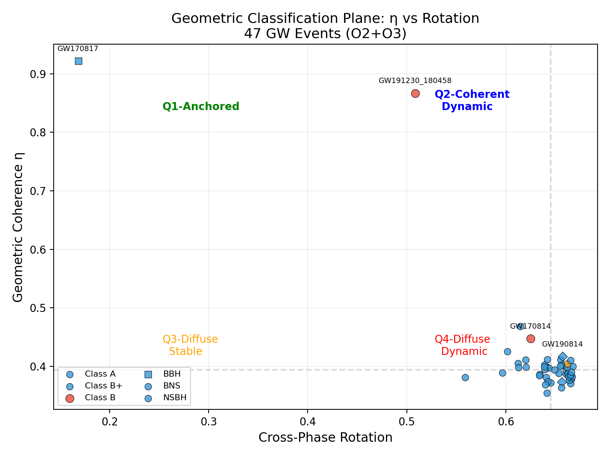
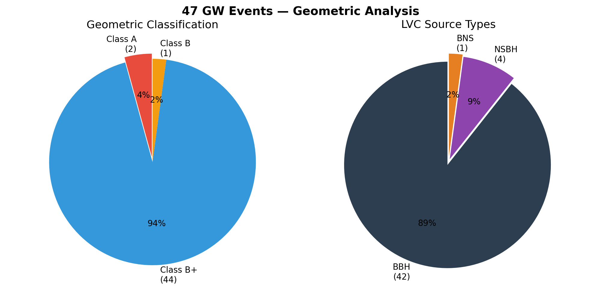
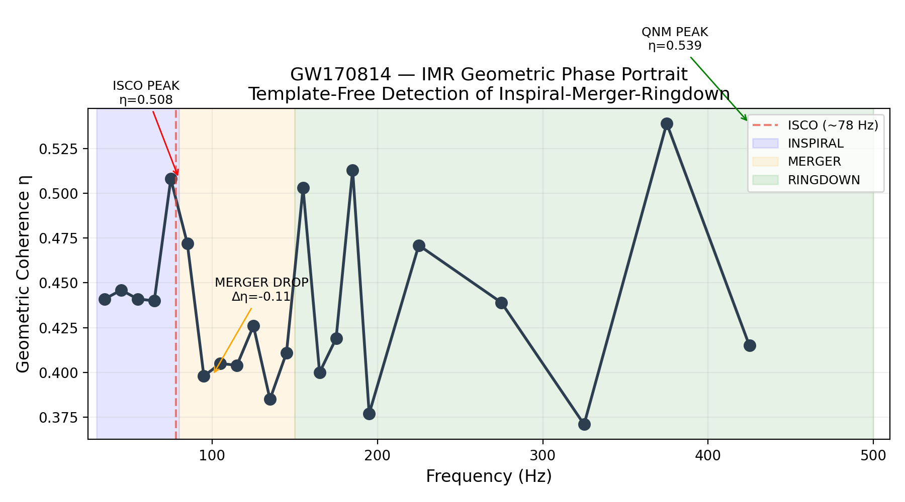

# Template-Free Geometric Analysis of Gravitational-Wave Events

[](https://doi.org/10.5281/zenodo.18228132)

**Pipeline, dataset, and geometric classification catalog accompanying:**

> Burgos, M. E. *Template-Free Geometric Analysis of Gravitational-Wave Events* (2026).  
> Zenodo. [10.5281/zenodo.18228132](https://doi.org/10.5281/zenodo.18228132)

---

## Overview

This repository contains the complete implementation of the template-free geometric analysis method described in the paper, along with the resulting **geometric classification dataset** for 47 gravitational-wave events from the LIGO-Virgo O2 and O3 observing runs.

The method operates directly on whitened strain data from interferometric detector networks, without using waveform templates. It extracts coherent geometric modes via spectral operator decomposition and classifies events based on their intrinsic network-space coherence structure.

**This dataset fulfills the "Future Work" section of the paper** (Section 6), specifically:

> *"Systematic analysis of the full GWTC would establish a complete geometric taxonomy and reveal potential correlations with astrophysical source properties."*

---

## Key Visualizations

### Geometric Classification Plane (η vs Rotation)



Each point is a GW event. **η** measures geometric coherence (how clean the signal is in detector space). **Rotation** measures cross-phase stability (how much the geometry changes from inspiral to merger). The plane reveals four natural quadrants with distinct astrophysical properties.

### Event Distribution



**94% of confident GWTC events are Class B⁺** (multi-component coherent geometry). Only 2 events achieve Class A (one-dimensional geometry). Zero false positives — all events show measurable geometric coherence.

### IMR Phase Portrait — GW170814



The geometric method detects the inspiral-merger-ringdown transition **without templates**. The ISCO appears as a peak in η at ~78 Hz. The merger appears as a sharp drop (Δη = -0.11). The ringdown shows quasinormal mode oscillations. **Template-free mass estimate: M ≈ 55.0 M☉ (GWTC: 55.8 M☉, error -1.4%).**

## Dataset

**`data/geometric_classification_dataset.csv`** — 47 events, 51 columns including:

| Category | Columns | Description |
|---|---|---|
| **LIGO astrophysical** | 11 | Masses, SNR, spin, p_astro, source type (from GWTC) |
| **Geometric core** | 6 | η (coherence), λ₁/λ₂, λ₂/λ₃, geometric class (A/B⁺/B/C), geometry mode, symmetry |
| **Geometric extended** | 5 | Cross-phase rotation, detector trajectory, quadrant, η/SNR ratio |
| **Per-phase** | 6 | η per IMR phase, waveform/envelope correlation with LIGO strain |
| **Detector power** | 3 | H1/L1/V1 participation in merger phase |
| **IMR granular** | 12 | ISCO η peak, merger drop, QNM peak frequency, ringdown amplitude, Class A regions |
| **Geometric mass** | 5 | Template-free total mass estimate from ISCO detection (GW170814) |

### Key findings

- **Class distribution**: A: 2 (4%), B⁺: 44 (94%), B: 1 (2%), C: 0 (0%)
- **All 47 confident GWTC events show geometric coherence** (B⁺ or better — zero false positives)
- **GW170814**: Template-free mass estimate M ≈ 55.0 M☉ (GWTC: 55.8 M☉, error -1.4%)
- **GW191230_180458**: Second Class A event discovered (η=0.867)
- **Geometric phases**: 1-7 per event (mean 3.5), data-driven IMR sub-structure

## Pipeline

The analysis pipeline is in `pipeline/`:

| Script | Purpose |
|---|---|
| `narrowband.py` | Core geometric analysis per frequency band |
| `classify.py` | Geometric classification (A/B⁺/B/C) |
| `waveforms.py` | Geometric waveform reconstruction + LIGO comparison |
| `run_pipeline.py` | Orchestrator: 3-band narrowband → classify → waveform |
| `batch_all.py` | Batch processing for multiple events |
| `batch_imr.py` | Granular IMR phase analysis (30–500 Hz) |
| `projected_eigenvalues.py` | Static eigenvalue spectrum visualization |

### Quick start

```bash
pip install -r requirements.txt
cd pipeline
python run_pipeline.py --event GW170814
```

## Citation

If you use this software or dataset in your research, please cite:

```bibtex
@software{burgos2026gwgeometric,
  author    = {Burgos, Marcelo Ernesto},
  title     = {Template-Free Geometric Analysis of Gravitational-Wave Events},
  year      = {2026},
  doi       = {10.5281/zenodo.18228132},
  url       = {https://github.com/mburgc/gw-geometric-analysis}
}
```

## License

MIT License — see [LICENSE](LICENSE) file.

The accompanying dataset (`data/geometric_classification_dataset.csv`) is also distributed under MIT for maximum reusability.
